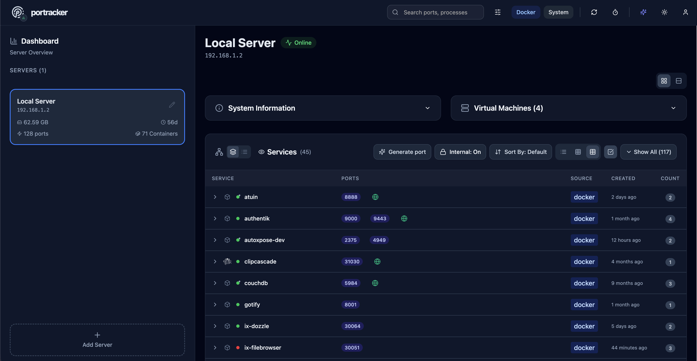

<div align="center">
  
  <h1 style="font-size: 3em; margin-bottom: 0.1em;">portracker</h1>
</div>

<p align="center">
  <strong>A self-hosted, real-time port monitoring and discovery tool.</strong>
</p>

<p align="center">
  <a href="https://github.com/mostafa-wahied/portracker/blob/main/LICENSE"></a>
  <a href="https://hub.docker.com/r/mostafawahied/portracker"></a>
  <a href="https://github.com/mostafa-wahied/portracker/releases"></a>
    <a href="https://github.com/mostafa-wahied/portracker/actions"></a>
</p>

<p align="center">
  <picture>
    <source media="(prefers-color-scheme: dark)" srcset="screenshots/main-light-v1.3.png" />
    
  </picture>
</p>

By auto-discovering services on your systems, portracker provides a live, accurate map of your network. It helps eliminate manual tracking in spreadsheets and prevents deployment failures caused by port conflicts.

---

## Key Features

- **Automatic Port Discovery**: Scans the host system to find and display running services and their ports automatically. No manual data entry is needed.
- **Platform-Specific Collectors**: Includes specialized collectors for Docker and TrueNAS to gather rich, contextual information from the host.
- **Internal Port Detection**: Distinguishes between internal container ports and published host ports, providing complete visibility into containerized services.
- **Lightweight & Self-Contained**: Runs as a single process with an embedded SQLite database. No external database dependencies like PostgreSQL or Redis are required.
- **Peer-to-Peer Monitoring**: Add other `portracker` instances as peers to view all your servers, containers, and VMs from a single dashboard.
- **Hierarchical Grouping**: Organize servers in a parent-child structure, perfect for nesting servers, e.g. a VM's `portracker` instance under its physical host.
- **Enhanced TrueNAS Discovery**: Providing an optional TrueNAS API key allows `portracker` to discover running VMs\* and gather enhanced system information like the OS version and uptime.
- **Modern & Responsive UI**: A clean dashboard with light/dark modes, live filtering, and multiple data layout views (list, grid, table).

<sub>\*_Note: VMs discovered on TrueNAS with the optional API key are shown in read-only mode. To enable full monitoring, deploy a portracker instance on each VM and add it as a separate server._</sub>

## Deployment

Deployment is designed to be simple using Docker.

### Quick Get Started

**Using Docker Compose:**

Create a `docker-compose.yml` file:

```yaml
services:
  portracker:
    image: mostafawahied/portracker:latest
    container_name: portracker
    restart: unless-stopped
    pid: "host"  # Required for port detection
    # Required permissions for system ports service namespace access
    cap_add:
      - SYS_PTRACE     # Linux hosts: read other PIDs' /proc entries
      - SYS_ADMIN      # Docker Desktop: allow namespace access for host ports (required for MacOS)
    security_opt:
      - apparmor:unconfined # Required for system ports
    volumes:
      # Required for data persistence
      - ./portracker-data:/data
      # Required for discovering services running in Docker
      - /var/run/docker.sock:/var/run/docker.sock:ro
    ports:
      - "4999:4999"
    # environment:
      # Optional: For enhanced TrueNAS features
      # - TRUENAS_API_KEY=your-api-key-here
```

Then, run the application:

```sh
docker-compose up -d
```

**Using Docker Run:**

```sh
docker run -d \
  --name portracker \
  --restart unless-stopped \
  --pid host \
  --cap-add SYS_PTRACE \
  --cap-add SYS_ADMIN \
  --security-opt apparmor=unconfined \
  -p 4999:4999 \
  -v ./portracker-data:/data \
  -v /var/run/docker.sock:/var/run/docker.sock:ro \
  mostafawahied/portracker:latest
```

### Enhanced Security with Docker Proxy

For enhanced security, you can run portracker without direct access to the Docker socket by using a proxy. This restricts the Docker API permissions to read-only operations.

**Using Docker Compose:**

```yaml
services:
  docker-proxy:
    image: tecnativa/docker-socket-proxy:latest
    container_name: portracker-docker-proxy
    restart: unless-stopped
    environment:
      - CONTAINERS=1
      - IMAGES=1
      - INFO=1
      - NETWORKS=1
      - POST=0
    volumes:
      - /var/run/docker.sock:/var/run/docker.sock:ro
    ports:
      - "2375:2375"

  portracker:
    image: mostafawahied/portracker:latest
    container_name: portracker
    restart: unless-stopped
    pid: "host"
    cap_add:
      - SYS_PTRACE
      - SYS_ADMIN
    security_opt:
      - apparmor:unconfined
    volumes:
      - ./portracker-data:/data
    ports:
      - "4999:4999"
    environment:
      - DOCKER_HOST=tcp://docker-proxy:2375
    depends_on:
      - docker-proxy
```

**Using Docker Run:**

```sh
# Start the Docker proxy
docker run -d \
  --name portracker-docker-proxy \
  --restart unless-stopped \
  -p 2375:2375 \
  -v /var/run/docker.sock:/var/run/docker.sock:ro \
  -e CONTAINERS=1 \
  -e IMAGES=1 \
  -e INFO=1 \
  -e NETWORKS=1 \
  -e POST=0 \
  tecnativa/docker-socket-proxy:latest

# Start portracker
docker run -d \
  --name portracker \
  --restart unless-stopped \
  --pid host \
  --cap-add SYS_PTRACE \
  --cap-add SYS_ADMIN \
  --security-opt apparmor=unconfined \
  -p 4999:4999 \
  -v ./portracker-data:/data \
  -e DOCKER_HOST=tcp://localhost:2375 \
  mostafawahied/portracker:latest
```

## Configuration

Configure `portracker` using environment variables.

| Variable           | Description                                            | Default               |
| ------------------ | ------------------------------------------------------ | --------------------- |
| `PORT`\*           | The port the web application will run on.              | `4999`                |
| `DATABASE_PATH`\*  | Path inside the container to the SQLite database file. | `/data/portracker.db` |
| `TRUENAS_API_KEY`  | Optional API key for enhanced TrueNAS data collection. | ` `                   |
| `ENABLE_AUTH`      | Set to `true` to enable authentication (v1.2.0+).      | `false`               |
| `SESSION_SECRET`   | Only needed with auth enabled. Prevents logout on container restart. | _random_  |
| `CACHE_TIMEOUT_MS` | Duration in milliseconds to cache scan results.        | `60000`               |
| `DISABLE_CACHE`    | Set to `true` to disable all caching.                  | `false`               |
| `INCLUDE_UDP`      | Set to `true` to include UDP ports in scans.           | `false`               |
| `DEBUG`            | Set to `true` for verbose application logging.         | `false`               |

<sub>\*_Required_</sub>

For a complete list of all environment variables with detailed explanations, see [`.env.example`](.env.example).

### TrueNAS Integration

<details>
<summary><strong>Click to expand TrueNAS setup guide</strong></summary>

#### Getting Your TrueNAS API Key

1. Log into your TrueNAS web interface
2. Go to **System Settings → API Keys**
3. Click **Add** to create a new API key
4. Give it a descriptive name (e.g., "portracker")
5. Copy the generated key
6. Add it to portracker:
   - **TrueNAS Apps**: Edit your portracker app → Add Environment Variable: `TRUENAS_API_KEY=your-api-key-here`
   - **Docker Compose**: Add to environment section:
     ```yaml
     environment:
       - TRUENAS_API_KEY=your-api-key-here
     ```

#### What You'll See

With the API key configured, portracker will display:
- ✅ TrueNAS native apps (from Apps catalog)
- ✅ Virtual machines (VMs)
- ✅ LXC containers
- ✅ Enhanced system information (OS version, uptime, etc.)

Without the API key, you'll only see Docker containers and system ports.

For timeout configuration options, see [`.env.example`](.env.example).

</details>

### Authentication Setup (v1.2.0+)

portracker includes optional authentication to secure dashboard access:

1. **Enable Authentication**: Set `ENABLE_AUTH=true` in your environment variables
2. **First-Time Setup**: On first access, you'll see a setup wizard to create the admin account
3. **Login**: Use your admin credentials to access the dashboard
4. **Stay Logged In** (optional): Set `SESSION_SECRET` to avoid being logged out on container restart

**Example with Authentication:**

```yaml
services:
  portracker:
    image: mostafawahied/portracker:latest
    environment:
      - ENABLE_AUTH=true
      - SESSION_SECRET=your-random-secret-here-change-this
```

**Important Notes:**
- Authentication is **disabled by default** for backward compatibility
- When enabled, the dashboard requires login but API endpoints for peer communication remain accessible
- API key authentication for peer-to-peer communication is available in v1.3.0

### Autoxpose Integration (v1.3.0+)

If you run [autoxpose](https://github.com/mostafa-wahied/autoxpose) to manage your public-facing services, portracker can display which ports are publicly exposed alongside their internal addresses.

**Setup:**

1. Open Settings (gear icon in header)
2. Expand the **autoxpose** section
3. Enter your autoxpose URL (e.g., `http://autoxpose:3000`)
4. Click **Connect**

**What You'll See:**

Once connected, exposed services show a public URL chip or globe badge next to the port:

- **URL Mode**: Full clickable chip showing `🌐 photos.example.com 🔒`
- **Badge Mode**: Compact globe icon with tooltip

**Display Options:**

- **Display Mode**: Toggle between URL chip or compact badge
- **URL Style**: Show subdomain only (compact) or full hostname

**SSL Status Indicators:**

| Icon | Color | Status |
|------|-------|--------|
| 🔒 | Green | SSL secured |
| ⚠️ | Amber | SSL pending |
| ❌ | Red | SSL error |

## Technical Stack

- **Backend**: Node.js, Express, WebSocket, better-sqlite3
- **Frontend**: React, Vite, Tailwind CSS, Shadcn UI
- **Containerization**: Docker

## Roadmap

Future development is focused on improving the application based on community feedback. Key areas include:

- ~~Adding user authentication~~ ✅ **Added in v1.2.0** (optional authentication with setup wizard)
- ~~Adding API key authentication for peer-to-peer communication~~ ✅ **Added in v1.3.0**
- ~~Autoxpose integration for public URL visibility~~ ✅ **Added in v1.3.0**
- Expanding the library of platform-specific collectors for other host systems
- Addressing bugs and incorporating requested changes from the community

## Star History

[](https://www.star-history.com/#mostafa-wahied/portracker&Date)

## Contributing

Contributions are welcome! Please feel free to open an issue to report a bug or suggest a feature, or submit a pull request with your improvements.

## License

This project is licensed under the MIT License - see the [LICENSE](https://github.com/Mostafa-Wahied/portracker/blob/main/LICENSE)
